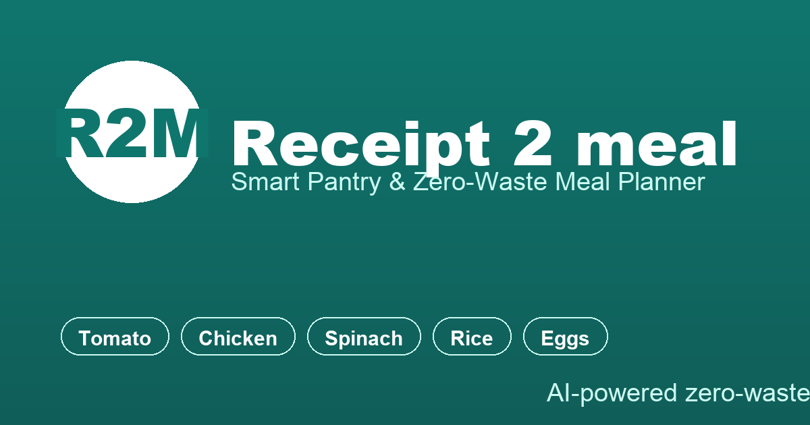

<p align="center">
  
</p>

<h1 align="center">Receipt 2 meal</h1>

<p align="center">
  <strong>Smart Pantry & Zero-Waste Meal Planner</strong><br/>
  Turn your grocery receipt (or whatever's in your fridge) into AI-powered daily meals — before anything goes bad.
</p>

<p align="center">
  <a href="#features">Features</a> &bull;
  <a href="#getting-started">Getting Started</a> &bull;
  <a href="#tech-stack">Tech Stack</a> &bull;
  <a href="#environment-variables">Environment Variables</a> &bull;
  <a href="#security">Security</a> &bull;
  <a href="#project-structure">Project Structure</a>
</p>

---

## Features

### 📸 Smart Ingredient Capture
- **Photo or text input** — snap a picture of your receipt, paste a shopping list, or type ingredients manually.
- **AI-powered parsing** powered by Google Gemini 2.5 Flash — extracts item names, quantities, units, categories, and storage locations automatically.
- Supports **bilingual input** (English / Chinese) and mixed-language lists.

### 🗄️ Pantry Inventory Tracker
- **Full lifecycle tracking** for every ingredient: purchase date, expiry date, category, storage location (fridge / freezer / pantry), quantity & unit.
- **Color-coded freshness indicators** — green → yellow → red as items approach their use-by date.
- **Auto-categorization** with 8 built-in categories (Proteins, Dairy, Grains, Vegetables, Fruits, Condiments, Beverages, Other).

### 🤖 AI Meal Plan Generator
- **3-meal daily plan** (breakfast, lunch, dinner) generated from your *actual* current inventory.
- Prioritizes **expiring ingredients first** — reduces waste by design.
- Each meal includes recipe name, ingredients with quantities, and step-by-step instructions.
- **Dynamic inventory deduction** — generated plans are reflected back into your pantry so you always know what you have left.

### ⚠️ Expiry Alerts & Restock Suggestions
- **Dashboard overview** shows today's expiring items, low-stock warnings, and a quick summary of your kitchen state.
- Smart restock suggestions based on what you cook most often.
- Shopping-list helper to plan your next grocery run.

### 🌐 Multi-Language UI
- Toggle between **English and Chinese** at any time — full UI translation, no page reload.

### 📱 PWA-Ready
- Installable as a home-screen app on mobile and desktop (Web App Manifest).
- Standalone display mode with portrait orientation lock.

### 🔍 SEO Content Layer
- Static content pages indexed by search engines:
  - [Zero-Waste Recipes Hub](public/recipes/index.html) — creative recipes for expiring ingredients
  - [Food Storage Guides](public/guides/index.html) — shelf-life references (eggs, chicken, spinach, herbs)
  - [Meal Planning 101 Guide](public/guides/meal-planning-101.html) — beginner-friendly prep guide
  - [Interactive Storage Calculator](public/tools/storage-calculator.html) — look up any ingredient's fridge life
  - [Zero-Waste Blog](public/blog/reduce-food-waste.html) — practical habits to cut food waste
- Structured data (Schema.org JSON-LD) for rich snippets.
- `llms.txt` for Generative Engine Optimization (GEO).

### 🔒 Privacy-First Architecture
- **Anonymous authentication** via Firebase — no email, no password, no account needed.
- All data stored per-device; no cross-user analytics without explicit opt-in.
- Transparent privacy policy and terms of service pages.

---

## Getting Started

### Prerequisites
- Node.js >= 18
- npm >= 9
- A Google Gemini API key ([get one free](https://aistudio.google.com/apikey))

### Quick Start

```bash
# Clone the repository
git clone https://github.com/mamawe/cook-by-receipt.git
cd cook-by-receipt

# Install dependencies
npm install

# Set up environment variables
cp .env.example .env.local
# Edit .env.local and fill in your GEMINI_API_KEY

# Start development server
npm run dev
```

Open [http://localhost:3000](http://localhost:3000) in your browser.

### Production Build & Deploy

```bash
npm run build        # Build frontend to dist/
node dist/server.cjs # Start production server (Express)
```

The app listens on port 3000 (configurable via `PORT` env var).

---

## Tech Stack

| Layer | Technology |
|-------|-----------|
| Frontend | React 19 + TypeScript + Vite 6 |
| Styling | Tailwind CSS 4 + custom emerald theme |
| State | React hooks (useState/useContext) |
| Backend | Express.js (Node.js) |
| Database | Cloud Firestore (Firebase) |
| Auth | Firebase Anonymous Authentication |
| AI | Google Gemini 2.5 Flash API |
| Analytics | Google Analytics 4 (optional, env-driven) |
| Deployment | Static SPA + Express API server |

---

## Environment Variables

Copy [`.env.example`](.env.example) to `.env.local` and configure:

| Variable | Required? | Description |
|----------|-----------|-------------|
| `GEMINI_API_KEY` | ✅ Yes | Google Gemini API key for AI parsing & meal generation |
| `ALLOWED_ORIGINS` | No | Comma-separated allowed origins for AI endpoints (default: localhost + `fridgechef.app`) |
| `NODE_ENV` | No | Set to `"production"` for production builds |
| `PORT` | No | Server listen port (default: `3000`) |
| `VITE_GA_ID` | No | Google Analytics 4 Measurement ID (`G-XXXXXXXXXX`). Leave empty to disable. |

See [`.env.example`](.env.example) for rate-limit tuning options.

---

## Security

- **Helmet.js** — sets security headers (CSP, HSTS, X-Content-Type-Options, etc.) in production.
- **Rate limiting** — three-tier protection on AI endpoints:
  - Global ceiling: 400 requests/15min
  - Ingredient parsing: 15 req/min per IP
  - Meal planning: 5 req/min per IP
- **Same-origin guard** — AI API routes reject cross-origin requests (configurable via `ALLOWED_ORIGINS`).
- **No secrets in client code** — API key stays server-side only.

---

## Project Structure

```
├── public/
│   ├── og-image.png              # Open Graph share image (1200×630)
│   ├── icon-512.png / icon-192.png  # PWA app icons
│   ├── favicon.ico               # Favicon (multi-size)
│   ├── manifest.json             # Web App Manifest
│   ├── llms.txt                  # GEO: machine-readable product description
│   ├── robots.txt                # Search engine crawler rules
│   ├── sitemap.xml               # Site map for SEO indexing
│   ├── privacy.html / terms.html  # Legal pages
│   ├── content-styles.css        # Shared styles for static content pages
│   ├── recipes/index.html        # Zero-waste recipes hub
│   ├── guides/                   # Food storage guide cluster (hub + 6 articles)
│   ├── tools/                    # Interactive tools hub + calculator
│   └── blog/                     # Zero-waste blog article
├── src/
│   ├── App.tsx                   # Root component (router + layout)
│   ├── main.tsx                  # Entry point + GA4 injection
│   ├── components/
│   │   ├── CaptureModal.tsx      # Photo/text ingredient capture UI
│   │   ├── TodayTab.tsx          # Dashboard (expiry alerts, stats, suggestions)
│   │   ├── PantryTab.tsx         # Inventory table (CRUD + filters)
│   │   └── PlanTab.tsx           # Meal plan viewer
│   └── lib/
│       ├── translations.ts       # EN/ZH UI strings
│       ├── types.ts              # TypeScript interfaces
│       └── date.ts               # Localized date helpers (timezone-safe)
├── scripts/
│   └── gen_assets.py             # PIL-based brand asset generator
├── server.ts                     # Express backend (API routes + static serving)
├── index.html                    # SPA shell (meta tags, schema.org, GA placeholder)
├── vite.config.ts                # Vite config (Tailwind, alias, code-splitting)
├── tsconfig.json                 # TypeScript config
├── package.json                  # Dependencies & scripts
├── .env.example                  # Environment variable template
├── metadata.json                 # AI Studio project manifest
└── README.md                     # This file
```

---

## License

MIT

---

<p align="center">
  Built with ❤️ using React, Express, and Google Gemini.<br/>
  <a href="https://fridgechef.app">Live Demo</a> &bull; <a href="./public/privacy.html">Privacy Policy</a> &bull; <a href="./public/terms.html">Terms of Service</a>
</p>
